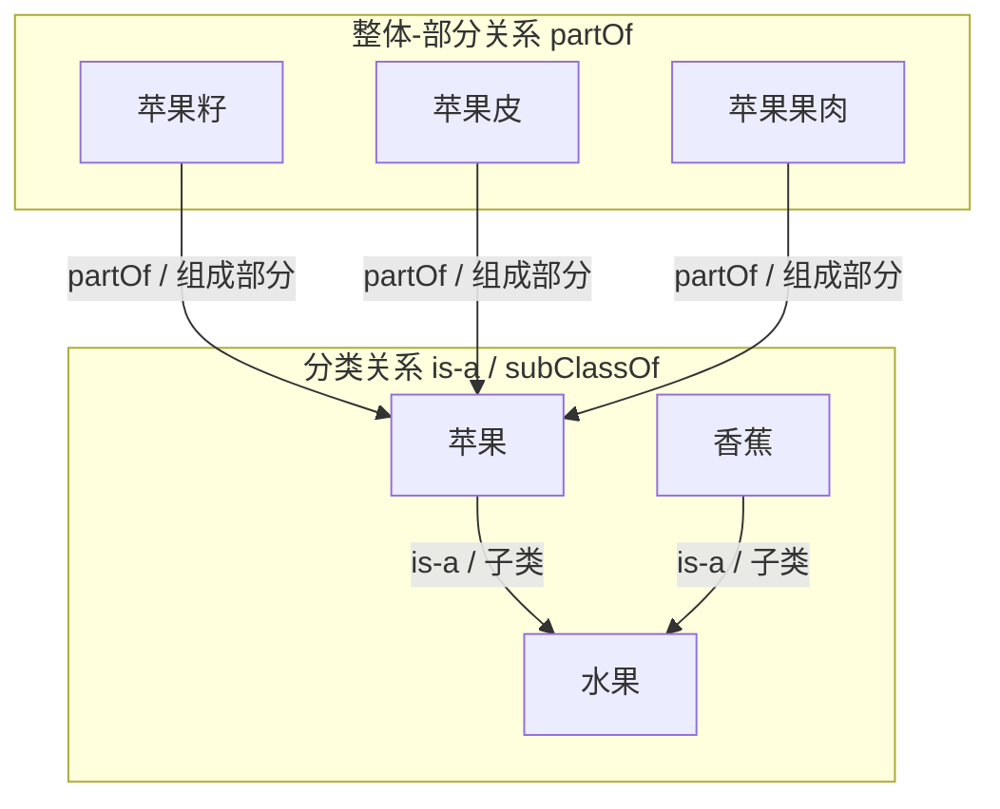

### 方案一：物理层级统一映射为 `is-a` 分类关系，`part-of` 关系全手动声明
```asciidoc
= 水果知识图谱示例

== 建模约定
本文档统一约定语义映射规则：所有上下级标题的物理包含关系，全程映射为 `is-a` 分类从属关系，由文档层级自动承载；所有整体-部分（`part-of`）关系均通过正文交叉引用显式声明。

== 水果
水果是对多汁、多以甜味与酸味为主要味觉的可食用植物果实的统称，富含维生素、膳食纤维与水分，是人类日常饮食的重要组成部分。

[phylum=被子植物门, family_taxon=蔷薇科]
=== 苹果
苹果为蔷薇科苹果亚科苹果属植物的果实，在全球温带地区广泛种植。
果实包含xref:苹果皮[rel=has-part]、xref:苹果果肉[rel=has-part]、xref:苹果籽[rel=has-part]三个核心组成部分，不同部分具有不同的营养成分与食用价值。

=== 香蕉
genus:: 芭蕉属
taste:: 香甜软糯

香蕉为芭蕉科芭蕉属植物的果实，原产于东南亚热带地区，现全球热带区域均有广泛栽培，是产量最高的热带水果之一。

== 苹果皮
苹果皮是xref:苹果[rel=part-of]的外层保护结构，表皮多带有天然果蜡，富含膳食纤维与多酚类抗氧化物质。

== 苹果果肉
苹果果肉是xref:苹果[rel=part-of]的主要食用部分，肉质多为脆嫩或绵密口感，富含糖分、维生素与多种矿物质。

== 苹果籽
苹果籽是xref:苹果[rel=part-of]的种子部分，位于果实中心的果核内，呈深褐色，含有少量苦杏仁苷物质，通常不直接食用。
```

---

### 方案二：物理层级统一映射为 `part-of` 整体-部分关系，`is-a` 关系全手动声明
```asciidoc
= 水果知识图谱示例

== 建模约定
本文档统一约定语义映射规则：所有上下级标题的物理包含关系，全程映射为 `part-of` 整体-部分关系，由文档层级自动承载；所有分类从属（`is-a`）关系均通过正文交叉引用显式声明。

== 苹果
苹果是xref:水果[rel=is-a]的一种，为蔷薇科苹果亚科苹果属植物的果实，在全球温带地区广泛种植。

=== 苹果皮
苹果皮是苹果的外层保护结构，表皮多带有天然果蜡，富含膳食纤维与多酚类抗氧化物质。

=== 苹果果肉
苹果果肉是苹果的主要食用部分，肉质多为脆嫩或绵密口感，富含糖分、维生素与多种矿物质。

=== 苹果籽
苹果籽是苹果的种子部分，位于果实中心的果核内，呈深褐色，含有少量苦杏仁苷物质，通常不直接食用。

== 香蕉
香蕉是xref:水果[rel=is-a]的一种，为芭蕉科芭蕉属植物的果实，原产于东南亚热带地区，现全球热带区域均有广泛栽培，是产量最高的热带水果之一。

== 水果
水果是对多汁、多以甜味与酸味为主要味觉的可食用植物果实的统称，富含维生素、膳食纤维与水分，是人类日常饮食的重要组成部分。
```



┌────┐
│ x  │
└────┘
│  
▼  
┌────┐
│ y  │
└────┘
